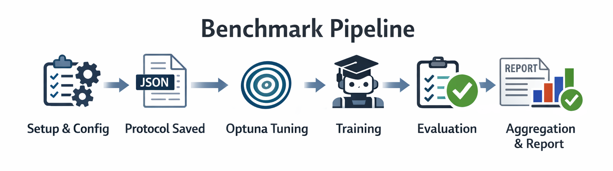
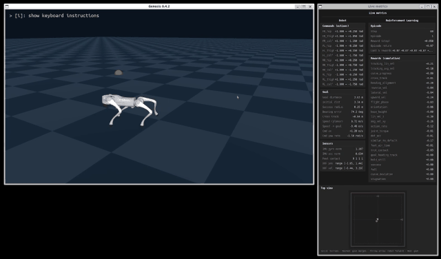
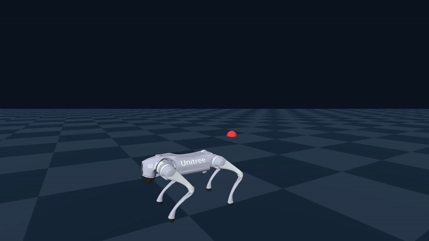
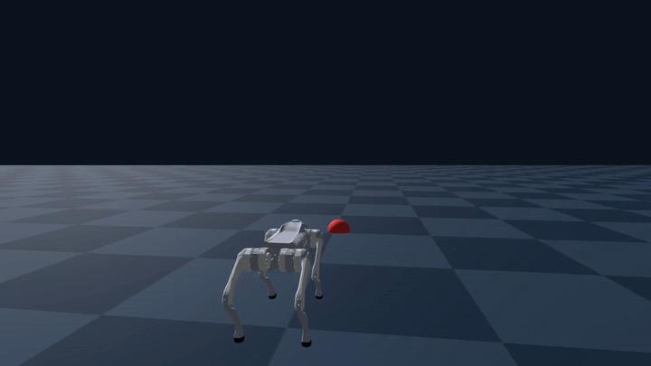
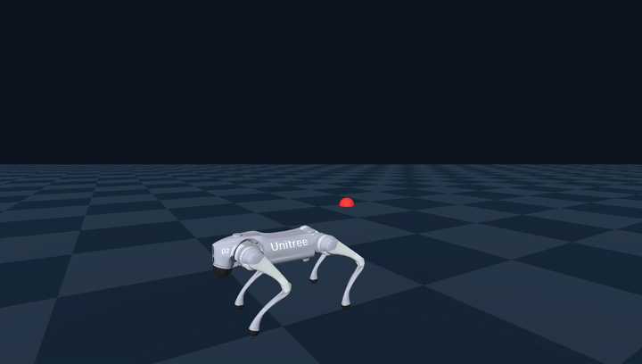
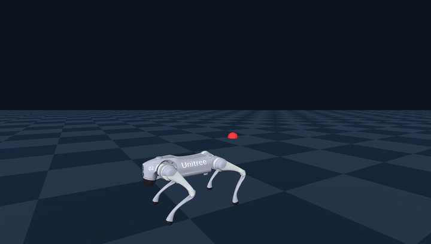

<div align="center">

## Deep Reinforcement Learning for Quadruped Locomotion in Genesis

**Research-grade experiments for Bézier-commanded Unitree Go2 locomotion in Genesis, centered on the CROS 2026 comparative study of PPO, SAC, and TD3 across flat, irregular procedural, and rough subterrain profiles.**

[](https://github.com/brunolemosdl/quadruped-rl-genesis/stargazers)
[](https://github.com/brunolemosdl/quadruped-rl-genesis/network/members)
[](https://github.com/brunolemosdl/quadruped-rl-genesis/issues)
[](https://github.com/brunolemosdl/quadruped-rl-genesis/graphs/contributors)
[](https://github.com/brunolemosdl/quadruped-rl-genesis/commits)

[](https://www.python.org/)
[](https://github.com/Genesis-Embodied-AI/Genesis)
[](https://github.com/DLR-RM/stable-baselines3)
[](https://optuna.org/)
[](#how-to-cite)

[Benchmark Diagram](#benchmark-diagram) • [Overview](#experiment-overview) • [Visualization Mode Walkthrough](#visualization-mode-walkthrough) • [Success Examples](#success-examples) • [Failure Examples](#failure-examples) • [Algorithms](#algorithm-matrix) • [Quick Start](#quick-start) • [Training](#training-workflows) • [Benchmark](#benchmark-and-extensions) • [Artifacts](#artifact-layout) • [Setup](#setup) • [Citation](#how-to-cite)

</div>

This repository packages the experimental environment, training workflows, evaluation protocol, artifact layout, and visualization tools used to study deep reinforcement learning for quadruped locomotion in Genesis. Its public scientific anchor is the **CROS 2026** paper:

> **Deep Reinforcement Learning for Quadruped Locomotion in Genesis: A Comparative Study of PPO, SAC, and TD3 in Irregular Terrains**

The current codebase is designed to be both a **reproducibility scaffold** for the published comparison and an **extensible research repo** with Optuna-based tuning, batch benchmarking, `VecNormalize`, and video generation utilities.

## Benchmark Diagram

The figure below summarizes the scientific flow used in this repository (baseline, tuning phases, and final multi-seed evaluation). Full benchmark details are in `Benchmark And Extensions`.

<div align="center">
  
</div>

## Experiment Overview

| Component              | Current repository implementation                                                                                                                                                                                    |
| ---------------------- | -------------------------------------------------------------------------------------------------------------------------------------------------------------------------------------------------------------------- |
| Robot                  | Unitree Go2 (URDF under `assets/urdf/robots/go2/urdf/go2.urdf`)                                                                                                                                                      |
| Simulator              | Genesis **0.4.2** (`genesis-world==0.4.2` in `pyproject.toml`)                                                                                                                                                       |
| Task                   | Fixed-per-episode cubic Bézier route; planner samples **96** polyline points, **1 m** lookahead, body-frame planar command (longitudinal speed and yaw rate, zero lateral) with curvature-aware speed limits         |
| Terrain profiles       | **`flat`** (planar), **`irregular`** (procedural heightmap), **`rough`** (Genesis subterrain grid); **`default`** is a shorter smoke-test profile with no full curricula                                             |
| Parallel training      | 1024 envs in `flat` / `irregular` / `rough`; `default` uses fewer (see `training.train_num_envs`)                                                                                                                    |
| Evaluation parallelism | 32 envs in `flat` / `irregular` / `rough`; `default` uses fewer (`training.eval_num_envs`)                                                                                                                           |
| Control                | **Position PD** on joints: `kp=22.0`, `kd=0.7`, action scale **0.25**, simulated action latency (`environment.control` in YAML)                                                                                      |
| Action space           | **12 joint position offsets** relative to a nominal stand pose (not direct torques)                                                                                                                                  |
| Observation stack      | **55-D** default vector (gravity, gyro, planner cmd, cross-track and heading features, remaining arc distance, goal heading, joint pos/vel errors, foot contact, previous action)—no camera/LiDAR in the paper setup |
| Observation sources    | Same stack as left; see `environment.observations` in experiment YAML                                                                                                                                                |
| Success vs. gates      | **Termination success** (permissive; used during training) vs. **`evaluation.scientific_gates`** (strict stop-and-settle acceptance—the paper’s secondary filter)                                                    |
| Failure / termination  | success, **timeout (22 s)**, fall/posture, curve deviation, stagnation (see `environment.simulator.dt`, `termination`, `bezier.*`)                                                                                   |
| Algorithms             | PPO, SAC, TD3, plus **`random`** (i.i.d. uniform actions) as in the paper                                                                                                                                            |
| Tuning                 | Optuna                                                                                                                                                                                                               |
| Outputs                | checkpoints, best/final models, VecNormalize stats, eval summaries, Optuna studies, reports, videos                                                                                                                  |

### What the task is doing

At a high level, the environment builds a **Bézier-commanded Go2 navigation task** in Genesis:

- The robot starts from a stable base pose.
- A goal is sampled within terrain bounds and distance constraints.
- A cubic Bézier curve is generated once per episode from spawn pose to goal.
- The planner projects the robot onto that curve and emits `[cmd_vx, cmd_vy=0, cmd_yaw_rate]` (body frame), using **96** samples along the curve by default, **1 m** lookahead, and near-goal deceleration (`bezier.*` in YAML).
- The policy receives a fixed-dimensional observation (55-D with the default observation stack) built from:
  - projected gravity and IMU gyroscope
  - commanded velocity and geometric tracking errors
  - joint position/velocity
  - foot contact
  - previous actions
- Rewards combine command tracking, curve progress, lateral-error control, gait cleanup, stability, and final stopping/alignment.
- Episodes terminate on success, fall, posture violation, excessive curve deviation, stagnation, or timeout.

### Terrain profiles

- `flat`: flat-terrain baseline for locomotion and goal-reaching behavior without terrain disturbances
- `irregular`: procedural heightmap (noise, terraces, optional curriculum); set `terrain.mode: irregular` and `terrain.generator` (this was the old `rough` experiment name)
- `rough`: subterrain grid (Genesis `Terrain` without a precomputed heightmap); set `terrain.mode: rough` and `terrain.rough` (grid size, types, parameters)
- `default`: shorter runs, smaller map, flat plane, no reward/goal curricula — for local smoke tests; use `flat` / `irregular` / `rough` for study-aligned configs

**Terrain config vocabulary:** `terrain.mode` is either `irregular` or `rough` (legacy strings `procedural` / `genesis_subterrain` still work as aliases). Irregular uses `terrain.generator` and optional `terrain.curriculum`. Rough uses `terrain.rough` (older YAML may use `terrain.genesis_subterrain` for the same block). Physical `terrain.size` must match the rough grid: `n_subterrains * subterrain_size` per axis.

Curriculum fields named `roughness_residual_m` / metrics `terrain_roughness_residual_m` refer to **residual height variation** on irregular procedural terrain, not to `terrain.mode: rough`.

**Migration:** The experiment name `rough` previously referred to the procedural irregular profile. That profile is now **`irregular`**. Artifact paths under `artifacts/experiments/rough/` from older runs do not match the new `rough` experiment; copy or rename directories if you need to reuse checkpoints, or retrain with the intended YAML.

### Reward structure

The reward stack is modular and logs term-level contributions. In short, it combines:

- linear and angular tracking of the planner commands
- progress along the Bézier arc with corridor and heading gating
- cross-track and heading alignment terms
- anti-pathology penalties for backward motion, lateral motion, upward jumping, and flight-heavy gaits
- stability/regularization penalties for base height, orientation, joint acceleration, torque, and action-rate spikes
- approach-zone rewards for final yaw alignment and holding still
- terminal success, fall, curve-deviation, and stagnation terms (paper-facing magnitudes: **+50** success, **−10** fall/posture, **−5** curve deviation, **−3** stagnation—dense terms are scaled by `dt` so weights are per-second)

When `rewards.curriculum.enabled` is true (e.g. `flat`, `irregular`, `rough`), rewards use a **three-stage** curriculum:

- `stage_1`: locomotion and curve following
- `stage_2`: gait cleanup and anti-hacking terms
- `stage_3`: final stop, align, and strict success

The `default` experiment profile disables reward curriculum for faster smoke tests.

Goal sampling may use `goal.curriculum` (wider distance ranges over training) when that block is enabled; it is off in the `default` experiment. With curriculum enabled, distances expand at **0, 2M, 6M, 12M, and 20M** environment steps (see `goal.curriculum.stage_steps` in `configs/experiments/flat.yaml` and `irregular.yaml`).

Reward curricula for study profiles switch stages at **0, 3M, and 8M** steps (`rewards.curriculum.stage_steps`): route following and stability first, then gait and anti-pathology terms, then near-goal heading and hold-still shaping.

## Visualization Mode Walkthrough

The video below shows the interactive visualization loop used to inspect policy behavior beyond scalar metrics. During a single session, you can switch goals, track online metrics, and observe how the robot adapts its gait and heading while following the planner commands.

This view is useful for checking whether a run is genuinely solving the task (goal progress + stable stopping) instead of only maximizing reward proxies. It also helps spot behavior drift early, such as over-rotation, lateral bias, or unstable footfall patterns that may not be obvious from summary JSON files alone.



> Full-resolution recording (MP4): [download/open raw file](https://raw.githubusercontent.com/brunolemosdl/quadruped-rl-genesis/master/media/videos/visualize.mp4)

## Success Examples

With the current reward/termination setup, the rollouts below are acceptable for completing the flat-terrain navigation objective. They are good enough for goal-reaching, while still leaving room for better stopping precision and robustness.

<table align="center">
  <tr>
    <td width="50%">
      
    </td>
    <td width="50%">
      
    </td>
  </tr>
</table>

## Failure Examples

These counterexamples are mainly linked to poor reward shaping and weak success-metric specification in earlier settings, which allowed undesirable behaviors during training/evaluation.

<table align="center">
  <tr>
    <td width="50%">
      
    </td>
    <td width="50%">
      
    </td>
  </tr>
</table>

## Algorithm Matrix

| Algorithm | Family     | In paper-first path | Repository notes                                                 |
| --------- | ---------- | ------------------- | ---------------------------------------------------------------- |
| `ppo`     | On-policy  | Yes                 | Default PPO baseline with SB3                                    |
| `sac`     | Off-policy | Yes                 | Supports Optuna and `utd_gs*` variants                           |
| `td3`     | Off-policy | Yes                 | Supports Optuna and `utd_gs*` variants                           |
| `random`  | Baseline   | Yes                 | Uniform random actions (non-learning floor, same wrappers as RL) |

### Hyperparameter sources

These names are passed as **`--hyperparams-source`** (algorithm YAML under `configs/algorithms/<alg>/`), not to be confused with the **`default`** _experiment_ profile in `configs/experiments/default.yaml`.

| Source                                                     | Purpose                                        | Notes                              |
| ---------------------------------------------------------- | ---------------------------------------------- | ---------------------------------- |
| `default`                                                  | Canonical SB3 / algorithm baseline YAML        | Start here for paper-oriented runs |
| `optuna`                                                   | Tuned overrides resolved from Optuna artifacts | Loaded from `artifacts/optuna/...` |
| `utd_gs1` / `utd_gs2` / `utd_gs4` / `utd_gs8` / `utd_gs16` | Off-policy update-to-data variants             | Available for SAC and TD3          |

## Quick Start

If you only want to run something quickly:

```bash
make setup
make train ALGORITHM=ppo EXPERIMENT=flat HYPERPARAMS_SOURCE=default
make evaluate ALGORITHM=ppo EXPERIMENT=flat MODEL_KIND=best
make visualize ALGORITHM=ppo EXPERIMENT=flat FAST_VIZ=1
```

## Training Workflows

### Paper-oriented baseline runs

Start with the published comparison:

```bash
make train ALGORITHM=ppo EXPERIMENT=flat HYPERPARAMS_SOURCE=default
make train ALGORITHM=ppo EXPERIMENT=irregular HYPERPARAMS_SOURCE=default
make train ALGORITHM=ppo EXPERIMENT=rough HYPERPARAMS_SOURCE=default
make train ALGORITHM=sac EXPERIMENT=flat HYPERPARAMS_SOURCE=default
make train ALGORITHM=sac EXPERIMENT=irregular HYPERPARAMS_SOURCE=default
make train ALGORITHM=sac EXPERIMENT=rough HYPERPARAMS_SOURCE=default
make train ALGORITHM=td3 EXPERIMENT=flat HYPERPARAMS_SOURCE=default
make train ALGORITHM=td3 EXPERIMENT=irregular HYPERPARAMS_SOURCE=default
make train ALGORITHM=td3 EXPERIMENT=rough HYPERPARAMS_SOURCE=default
```

With `HYPERPARAMS_SOURCE=default`, runs map to `configs/algorithms/<alg>/default.yaml` and experiment profiles under `configs/experiments/`.

### Training one algorithm explicitly

```bash
make train ALGORITHM=ppo EXPERIMENT=irregular HYPERPARAMS_SOURCE=default SEED=42 DEVICE=auto
```

### Evaluation

Evaluate the latest best model for the requested `experiment + algorithm + hyperparams_source`:

```bash
make evaluate ALGORITHM=ppo EXPERIMENT=irregular MODEL_KIND=best
```

To evaluate the final checkpoint instead:

```bash
make evaluate ALGORITHM=ppo EXPERIMENT=irregular MODEL_KIND=final
```

You can also resolve a specific training run without passing a model path:

```bash
make evaluate ALGORITHM=ppo EXPERIMENT=irregular TRAIN_SEED=42
```

For an exact run id:

```bash
PYTHONPATH=src ./.venv/bin/python main.py evaluate \
  --experiment irregular \
  --algorithm ppo \
  --run-id 20260331-142000_seed42_default
```

### Visualization

Open a viewer run for the latest model matching the requested source:

```bash
make visualize ALGORITHM=ppo EXPERIMENT=irregular FAST_VIZ=1
```

A no-policy sanity check is also supported by the low-level CLI via `--no-model`. When a visualization or evaluation is not tied to a training run, the outputs go to `artifacts/ad_hoc/...`.

### Monitoring runs

Training and Optuna trials already write TensorBoard event files under each run directory, so you can monitor the suite without opening JSON artifacts manually.

Launch TensorBoard for a benchmark output root:

```bash
PYTHONPATH=src ./.venv/bin/python main.py monitor \
  --mode tensorboard \
  --output-root paper_outputs \
  --host 0.0.0.0 \
  --port 6006
```

This points TensorBoard at `paper_outputs/artifacts`, which includes both training runs and Optuna trial logs.

If you prefer a terminal-only summary, the CLI can read the latest artifacts directly:

```bash
PYTHONPATH=src ./.venv/bin/python main.py monitor \
  --mode summary \
  --output-root paper_outputs \
  --watch \
  --interval 30
```

Useful shortcut:

```bash
make monitor MONITOR_MODE=summary WATCH=1
```

## Benchmark And Extensions

### Scientific Protocol

The repository supports a **two-phase scientific tuning protocol** for the Bézier-commanded Genesis + Go2 task.

The flow diagram is shown near the beginning of this README in `Benchmark Diagram`.

Scientific gates are configured per experiment in `evaluation.scientific_gates`. When `enabled: true`, thresholds such as `success_rate_min`, final goal distance, yaw error, stop speed, fall/timeout, curve deviation, stagnation, and motion-quality ratios must pass for selection/ranking. The `default` experiment sets `scientific_gates.enabled: false` so local smoke runs are not blocked by gates.

The paper’s learning-dynamics statistics (normalized AUC over task score, first step with positive task score, fraction of positive checkpoints, peak-to-last drop) are derived from periodic deterministic evaluations logged under each run (e.g. `evaluations.npz` alongside TensorBoard)—use the same evaluation cadence as in `training.*` YAML when reproducing those diagnostics.

### Optuna tuning

Optuna is an extension layer for systematic search rather than the first thing to run when reproducing the paper baseline.

```bash
make tune ALGORITHM=sac EXPERIMENT=irregular
make tune ALGORITHM=td3 EXPERIMENT=irregular
```

By default, tuning executes in two phases (`locomotion` then `goal_stop`) using:

- `configs/optuna/default.yaml` — per-phase **`trial_timesteps`** (10M then 15M by default), **`eval_freq_env_steps: 100000`**, **`eval_episodes: 8`**, and phase trial counts
- experiment-level `optuna.search_space` (environment/reward/success paths)
- algorithm-level `optuna.search_space` (SB3 hyperparameters)

Edit `configs/optuna/default.yaml` if you need shorter trials, but keep in mind that the reward curriculum only fully activates after **8M** steps.

To tune from a reduced-UTD base while preserving parity across SAC and TD3:

```bash
make tune ALGORITHM=sac EXPERIMENT=irregular HYPERPARAMS_SOURCE=utd_gs2
make tune ALGORITHM=td3 EXPERIMENT=irregular HYPERPARAMS_SOURCE=utd_gs2
```

After studies are saved, the repository persists `best_overrides.yaml` and `best_resolved_config.yaml` under `artifacts/optuna/<experiment>/<algorithm>/`. The CLI source `HYPERPARAMS_SOURCE=optuna` resolves directly from those artifacts. Until then, keep `HYPERPARAMS_SOURCE=default`.

### Full benchmark

The batch benchmark command orchestrates:

- optional Optuna tuning
- repeated training across experiments, algorithms, and seeds
- deterministic evaluation
- optional benchmark video recording

**Defaults** (`experiments`, `algorithms`, `seeds`, `output_root`, `seed`, `hyperparams_source`, etc.) match the previous CLI behaviour when you omit `--profile` and rely on environment variables such as `QUADRUPED_RL_GENESIS_DEFAULT_HPARAMS_SOURCE` and `QUADRUPED_RL_GENESIS_SEED`.

**Versioned profile (YAML)** — `configs/benchmarks/default.yaml` documents the article-style grid and can be loaded explicitly:

```bash
make benchmark DEVICE=cuda BENCHMARK_PROFILE=default
# equivalent:
main.py benchmark --profile default --device cuda
```

Any CLI flag overrides the same key from the profile file (for example `--device`, `--hyperparams-source`, `--seed`, `--tune-seed`, `--eval-seed`, `--experiments`, `--record-videos`).

Default benchmark (no profile file; same behaviour as before):

```bash
make benchmark DEVICE=cuda
```

To run a fair lower-UTD benchmark for SAC and TD3 while still training from Optuna outputs that already exist:

```bash
make benchmark DEVICE=cuda HYPERPARAMS_SOURCE=optuna TUNE_BASE_SOURCE=utd_gs2
```

Optional overrides via `Makefile` variables: `BENCHMARK_PROFILE`, `BENCHMARK_EXPERIMENTS`, `BENCHMARK_ALGORITHMS`, `BENCHMARK_SEEDS`, `SEED`, `TUNE_SEED`, `EVAL_SEED` (see `benchmark` target in the `Makefile`).

### Useful extensions

- Run partial stages with `--skip-tune` / `--no-skip-tune`, `--skip-train` / `--no-skip-train`, `--skip-eval` / `--no-skip-eval`
- Record benchmark videos with `--record-videos` / `--no-record-videos`
- Resume interrupted suites with `--resume` / `--no-resume`
- Use `utd_gs1`, `utd_gs2`, `utd_gs4`, `utd_gs8`, or `utd_gs16` when exploring off-policy variants outside the paper-first baseline

## Artifact Layout

The project stores outputs in predictable directory trees so experiments remain inspectable and reproducible.

### Standard training / evaluation outputs

```text
artifacts/
├── experiments/
│   └── <experiment>/
│       └── <algorithm>/
│           └── <timestamp>_seed<seed>_<hyperparams-source>/
│               ├── config/
│               │   ├── resolved_config.yaml
│               │   └── runtime_metadata.json
│               ├── logs/
│               │   ├── train.log
│               │   ├── evaluation.log
│               │   ├── visualization.log
│               │   └── tensorboard/
│               ├── checkpoints/
│               │   └── model_*_steps.zip
│               ├── models/
│               │   ├── best_model/best_model.zip
│               │   ├── best_model/vecnormalize.pkl
│               │   ├── final_model.zip
│               │   ├── vecnormalize.pkl
│               │   └── milestones/
│               │       ├── initial_model.zip
│               │       ├── middle_model.zip
│               │       └── final_model.zip
│               ├── eval/
│               │   ├── training_summary.json
│               │   └── evaluation_best.json
│               └── videos/
│                   ├── *_visualization_summary.json
│                   └── *.mp4
├── ad_hoc/
│   ├── evaluate/<experiment>/<algorithm>/<execution-id>/
│   │   ├── evaluation.log
│   │   └── evaluation_summary.json
│   └── visualize/<experiment>/<algorithm>/<execution-id>/
│       ├── visualization.log
│       ├── visualization_summary.json
│       └── *.mp4
└── optuna/
    └── <experiment>/
        └── <algorithm>/
            ├── best_overrides.yaml
            ├── best_resolved_config.yaml
            ├── best_trial_summary.json
            ├── study_summary.json
            └── phases/
                └── <phase-name>/
                    ├── current_trial.json
                    ├── study_summary.json
                    └── trials/
                        └── trial_0000/
                            ├── trial_overrides.yaml
                            ├── resolved_config.yaml
                            ├── trial_summary.json
                            ├── best_model/best_model.zip
                            ├── final_model.zip
                            └── vecnormalize.pkl
```

### Benchmark outputs

```text
paper_outputs/
├── logs/
│   └── benchmark.log
├── reports/
│   ├── benchmark_profile.json
│   └── benchmark_summary.json
└── artifacts/
    └── ...
```

### What to look at first

- `resolved_config.yaml`: exact merged config used in a run
- `training_summary.json`: structured summary of training-time evaluation
- `evaluation_*.json`: post-training evaluation results
- `best_overrides.yaml`, `best_resolved_config.yaml`, and `study_summary.json`: Optuna outputs
- `benchmark_summary.json`: top-level report for benchmark runs

## Repository Structure

```text
quadruped-rl-genesis/
├── configs/
│   ├── algorithms/
│   ├── experiments/
│   └── optuna/
├── media/
│   ├── gifs/
│   ├── images/
│   └── videos/
├── src/quadruped_rl_genesis/
│   ├── algorithms/
│   ├── config/
│   ├── environments/
│   ├── interface/
│   ├── navigation/
│   ├── operations/
│   ├── pipeline/
│   ├── services/
│   ├── simulation/
│   └── utils/
├── Dockerfile
├── Makefile
├── main.py
└── pyproject.toml
```

## Setup

### Recommended environment

Use Linux + Python **3.12 or 3.13** for the smoothest Genesis workflow (see `pyproject.toml`).

Minimum prerequisites:

- Python `>=3.12, <3.14` (as specified in `pyproject.toml`)
- `make`, Git, `ffmpeg`
- OpenGL/EGL-compatible runtime (for headless rendering)
- NVIDIA drivers (`nvidia-smi`) for CUDA runs

### Project bootstrap

```bash
make setup
make check
make quality
```

Useful commands:

- `make help` to list all workflows
- `make install` (alias for `make setup`)
- `make format` / `make lint`
- `make record MODEL_PATH=...` to export a rollout video

### Environment variables

The project reads `.env` and process env vars. Start with:

```bash
cp .env.example .env
```

Most used variables:

| Variable                                      | Default                                 | Description                                             |
| --------------------------------------------- | --------------------------------------- | ------------------------------------------------------- |
| `QUADRUPED_RL_GENESIS_SEED`                   | `42`                                    | Global seed used when not overridden by CLI             |
| `QUADRUPED_RL_GENESIS_DEVICE`                 | `auto`                                  | Default device for both Genesis and algorithm           |
| `QUADRUPED_RL_GENESIS_GENESIS_DEVICE`         | (uses `DEVICE`)                         | Device for Genesis simulation only                      |
| `QUADRUPED_RL_GENESIS_ALGORITHM_DEVICE`       | (uses `DEVICE`)                         | Device for RL algorithm (SB3) only                      |
| `QUADRUPED_RL_GENESIS_CONFIGS_ROOT`           | `configs`                               | Root for `configs/experiments` and `configs/algorithms` |
| `QUADRUPED_RL_GENESIS_DEFAULT_EXPERIMENT`     | `default`                               | CLI `--experiment` default when omitted                 |
| `QUADRUPED_RL_GENESIS_DEFAULT_HPARAMS_SOURCE` | `default`                               | CLI `--hyperparams-source` default when omitted         |
| `QUADRUPED_RL_GENESIS_ARTIFACTS_ROOT`         | `artifacts`                             | Main output directory for training/eval artifacts       |
| `QUADRUPED_RL_GENESIS_OPTUNA_STORAGE`         | `sqlite:///artifacts/optuna/studies.db` | Shared Optuna study storage                             |
| `QUADRUPED_RL_GENESIS_LOG_LEVEL`              | `INFO`                                  | Logging level                                           |

### Device tips

- `DEVICE=auto`: CUDA if available, else CPU
- `DEVICE=cpu`: safer for debugging
- `DEVICE=cuda`: preferred for large runs
- You can split devices, e.g. `GENESIS_DEVICE=cuda ALGORITHM_DEVICE=cpu`

### RunPod / Linux bootstrap

```bash
apt-get update && apt-get install -y \
  bash build-essential curl ffmpeg git tmux \
  libegl1 libgl1 libgles2 libglvnd0 libglib2.0-0 \
  libopengl0 libsm6 libxext6 libxrender1
```

### Docker

```bash
docker build -t quadruped-rl-genesis .
docker run --rm --gpus all \
  -v "$(pwd)/paper_outputs:/outputs" \
  quadruped-rl-genesis \
  --output-root /outputs \
  --device cuda
```

## Contributing

Contributions are welcome, especially if they improve reproducibility, reporting quality, or experiment management.

Good contribution targets include:

- new terrain profiles or evaluation protocols
- improved training diagnostics and plots
- reproducibility fixes for Genesis / CUDA environments
- cleaner experiment/run summaries
- README media, benchmark tables, and linked artifacts

When contributing:

- prefer reproducible config changes over hard-coded edits
- document new commands and artifact outputs
- keep experiment names, seeds, and hyperparameter sources explicit
- include the relevant evaluation JSON or benchmark summary when reporting results

## Authors

| Name            | ORCID                                                        | Email                       |
| --------------- | ------------------------------------------------------------ | --------------------------- |
| Bruno Lemos     | [0009-0000-7906-1751](https://orcid.org/0009-0000-7906-1751) | `bruno.lemos@dcc.ufmg.br`   |
| Rodrigo Silva   | [0000-0001-6795-1597](https://orcid.org/0000-0001-6795-1597) | `rodrigo.silva@dcc.ufmg.br` |
| Guilherme Maia  | [0000-0001-9758-7829](https://orcid.org/0000-0001-9758-7829) | `jgmm@dcc.ufmg.br`          |
| Luiz Chaimowicz | [0000-0001-8156-9941](https://orcid.org/0000-0001-8156-9941) | `chaimo@dcc.ufmg.br`        |

**Affiliation**  
Department of Computer Science  
Federal University of Minas Gerais (UFMG)  
Belo Horizonte, Brazil

## How To Cite

If you use this repository or build upon the experimental setup, please cite the CROS 2026 paper.

```bibtex
@INPROCEEDINGS{lemos2026quadrupedGenesis,
  author    = {Lemos, Bruno and Silva, Rodrigo and Maia, Guilherme and Chaimowicz, Luiz},
  title     = {Deep Reinforcement Learning for Quadruped Locomotion in Genesis: A Comparative Study of PPO, SAC, and TD3 in Irregular Terrains},
  booktitle = {2026 Brazilian Conference on Robotics (CROS)},
  year      = {2026},
  address   = {Jo{\~a}o Pessoa, Para{\'\i}ba, Brazil},
  publisher = {IEEE},
  isbn      = {979-8-3195-1715-9},
  keywords  = {Quadruped locomotion; deep reinforcement learning; legged robots; Genesis; Unitree Go2; PPO}
}
```

## Acknowledgments

- **Federal University of Minas Gerais (UFMG)** for the academic context and research environment.
- **Coordination for the Improvement of Higher Education Personnel (CAPES)** for the master's degree scholarship that supported the development of this project.
- **National Council for Scientific and Technological Development (CNPq)** for research funding support.
- **Foundation for Research Support of the State of Minas Gerais (FAPEMIG)** for research funding support.

---

- **Genesis** for the simulation platform used to build the locomotion task.
- **Stable-Baselines3** for the reinforcement learning implementations.
- **Optuna** for experiment tuning support.
- The broader legged-locomotion and DRL research community that shaped the comparative framing of this work.
